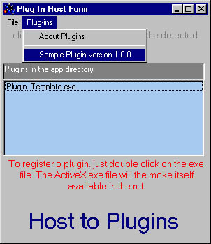

## Generic Plugin \(Plug\-In\) code \- generic multiple plugin detection \!\!\! \- Added to menus \+ Plugin Code

### Description

This is generic code to Automatically detect plugins and add them to the apps' menus. It supports multiple plugins. It will detect the plugins and query them for identification. It also allows you to pass objects and controls to the plugins. The code for the example plugin is also included. This code is small, commented and clean. Credits in the Readme file. You can just copy and paste this code to make your app Generic Plugin Enabled.Please vote !!!!
 
### More Info
 

             |
---                |---
**Submitted On**   |2001-07-03 09:20:36
**By**             |[N/A](https://github.com/Planet-Source-Code/PSCIndex/blob/master/ByAuthor/empty.md)
**Level**          |Intermediate
**User Rating**    |4.9 (141 globes from 29 users)
**Compatibility**  |VB 5\.0, VB 6\.0
**Category**       |[Complete Applications](https://github.com/Planet-Source-Code/PSCIndex/blob/master/ByCategory/complete-applications__1-27.md)
**World**          |[Visual Basic](https://github.com/Planet-Source-Code/PSCIndex/blob/master/ByWorld/visual-basic.md)
**Archive File**   |[Generic Pl22122732001\.zip](https://github.com/Planet-Source-Code/generic-plugin-plug-in-code-generic-multiple-plugin-detection-added-to-menus-plugin-code__1-24674/archive/master.zip)

